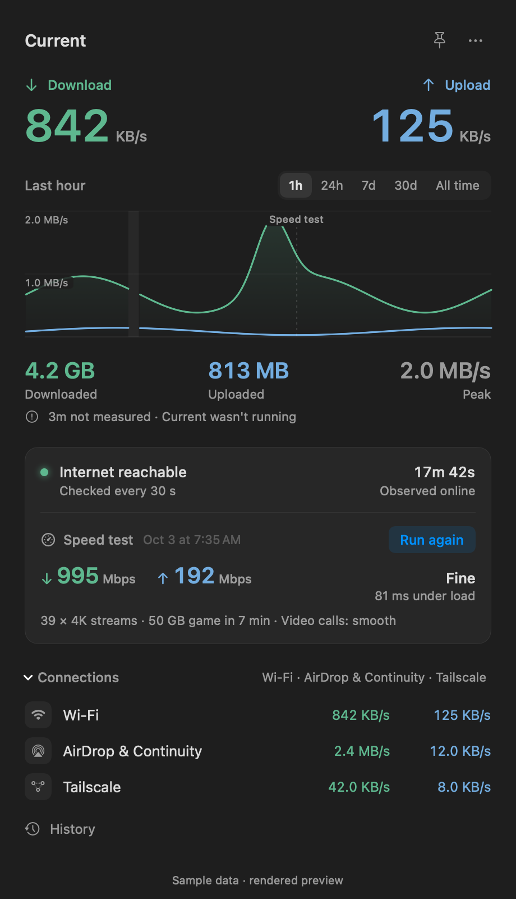
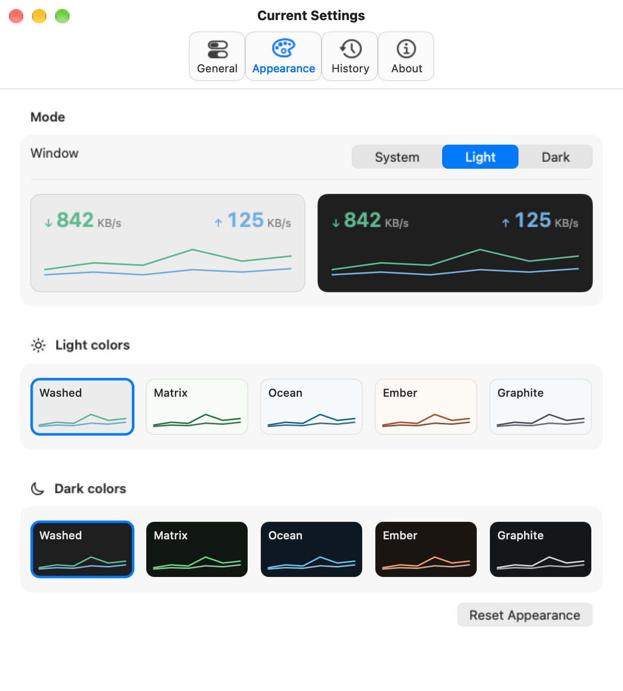

# Current

A free, open-source network monitor for the macOS menu bar. Native Swift, AppKit and SwiftUI, with local history and no account or analytics.

Current shows download and upload rates together, with a separate internet-health indicator. Open it for a recent graph, transferred totals, measured peaks, an on-demand speed test and the connections in use. Pin the panel and drag its title to keep it where you work, including on another connected screen.

<picture>
  <source media="(prefers-color-scheme: dark)" srcset="assets/current-dark.png">
  <source media="(prefers-color-scheme: light)" srcset="assets/current-light.png">
  
</picture>

## Download

[Download Current 0.1.0 for macOS](https://github.com/pocarles/current/releases/download/v0.1.0/Current.dmg). Open the DMG and drag Current to Applications.

The installer is Developer ID signed, Apple notarized and stapled. Requires macOS 14 or later and contains Apple Silicon and Intel binaries. Runtime verification has been performed on Apple Silicon; Intel hardware has not yet been tested. Updates are installed manually from [GitHub Releases](https://github.com/pocarles/current/releases). Current does not install itself at login.

## Features

- Live download and upload rates in a fixed-width menu-bar item.
- Internet checks that can detect a loss of access while Wi-Fi stays connected.
- Graphs and totals for the last hour, 24 hours, 7 days, 30 days or all recorded history.
- An on-demand speed test with plain-language results, which asks first on a phone hotspot.
- Connections in use right now: Wi-Fi, Ethernet, hotspot, Thunderbolt Bridge, Bluetooth, AirDrop & Continuity, Tailscale and other VPNs.
- Optional outage and recovery notifications, disabled by default.
- Independent light and dark palettes, with System, Light and Dark appearance modes.
- Local SQLite history, CSV export and consistent database backups.
- A movable pinned panel and a separate History window.

<p align="center">
<picture>
  <source media="(prefers-color-scheme: dark)" srcset="assets/current-settings-dark.png">
  <source media="(prefers-color-scheme: light)" srcset="assets/current-settings-light.png">
  
</picture>
</p>

## What the numbers mean

Rates measure bytes transferred through active physical network interfaces. They include LAN traffic and VPN encapsulation overhead. Tunnel counters are excluded from the physical total to avoid counting the same transfer twice. Multiple physical adapters are summed; routed or bridged transfers may appear on each participating adapter.

These are observed device-interface readings, not connection capacity, speed-test results or exact ISP billing. Peaks are measured sample rates. Connections lists only links in use, meaning they hold a usable address or carried traffic in the last 30 seconds. Tailscale and other VPN tunnels appear there separately; their bytes are never added to the physical history total. Current needs no Location permission, privileged helper or packet capture.

Counters reset safely after sleep, interface changes and counter resets. Missing observations, sleeping, app downtime and observed zero remain distinct. Current cannot recover traffic while it was closed or asleep. A crash can lose the last unsaved batch. If a normal quit cannot save pending observations, Current stays open so they can be retried.

## Privacy

Current stores history on this Mac in `~/Library/Application Support/Traffic/traffic.sqlite`. The Traffic folder, bundle identifier and preference keys are retained from development so the rename preserves existing data. It has no cloud history service, analytics or account system.

Internet checks contact `https://www.gstatic.com/generate_204`, with `https://cp.cloudflare.com/generate_204` as a fallback. Those endpoint operators see the public IP and normal connection metadata. Current expects an empty HTTP 204 response from the requested URL, declines redirects, disables cookies and caching, limits stored response data to 4 KiB and bounds each request to five seconds. TLS and data already in flight add network overhead beyond that storage limit.

Healthy checks normally run every 30 seconds, or every 120 seconds in Low Power Mode. Two failed rounds at least five seconds apart confirm an outage. Unexpected pages remain uncertain. A successful endpoint check does not guarantee every site is reachable. Checks can be paused without stopping passive traffic measurement. There are no continuous speed tests or network scans.

The speed test runs only when you ask. It uses macOS's built-in `networkQuality` tool, which contacts Apple's servers and moves data at full speed for about 12 seconds; faster connections use more data, often several hundred MB. On a connection macOS marks as metered, such as a phone hotspot, Current asks before starting. The result is stored in preferences and logged as a history event; the test's own traffic also appears in measured totals.

## History and backups

Writes are batched about once a minute, with additional saves around lifecycle and connection events. Minute summaries are retained for seven days, hourly summaries for 180 days and compact daily summaries for up to 100 years. Summaries preserve transferred bytes, measured peaks, downtime and coverage. SQLite growth is bounded; retention tiers overlap and are never added together for the same interval.

See [history and accuracy](docs/history.md) for retention, schema migrations, gaps, estimates and backup restoration. CSV uses UTC days. Backup includes retained resolutions and pending committed WAL data. Restoration is a manual file workflow after quitting Current.

## Build

Use Xcode's Swift toolchain. There are no third-party package dependencies.

```sh
git clone https://github.com/pocarles/current.git
cd current
./scripts/swift.sh test
./scripts/build-app.sh
open dist/Current.app
```

The local build is signed ad hoc for development. It has not been notarized for distribution. Set `TRAFFIC_DATA_DIR` to use a separate development database. Quit an existing instance before launching another against the same database.

Native window interaction tests require the connected Mac window server and `TRAFFIC_NATIVE_UI_TESTS=1`. Tests use synthetic outages rather than disrupting the network.

## Contributing

Focused bug reports and small improvements are welcome. Include macOS version, Current version and steps to reproduce. Avoid attaching your history database, network addresses or other private data. See [contributing](CONTRIBUTING.md) and [security reporting](SECURITY.md).

## License

[MIT](LICENSE). Copyright 2026 Pierre-Olivier Carles.
